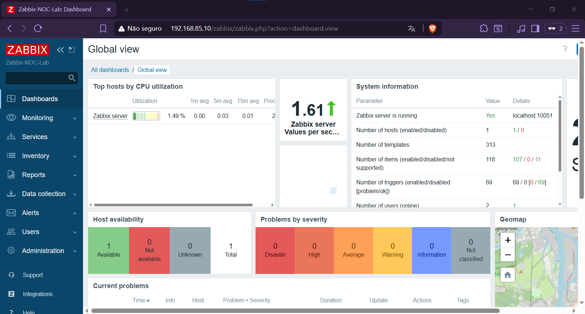

# 📡 Laboratório NOC com Zabbix

A proposta do projeto é simular um ambiente básico de NOC (Network Operations Center) em uma infraestrutura virtualizada utilizando VMware Workstation e Ubuntu Server.

A ideia do laboratório é praticar troubleshooting, monitoramento e administração Linux em um ambiente mais próximo do mundo real. Além disso, o projeto também funciona como espaço de estudo e experimentação, então parte da documentação inclui erros, ajustes e resolução de problemas realizados durante a implementação.

Futuramente, o ambiente também servirá como base para testes de automação com Ansible.

> [!IMPORTANT]
> **Status do Lab:** 🚧 Em desenvolvimento

---
# 🎯 Objetivos

- Implementar um ambiente de monitoramento utilizando Zabbix
- Monitorar serviços e hosts
- Simular cenários operacionais de um ambiente NOC
- Desenvolver habilidades práticas em Linux, redes, troubleshooting e automação
- Documentar todo o processo de implementação e configuração

---

# 🧱 Tecnologias Utilizadas

| Tecnologia          | Função                      |
| ------------------- | --------------------------- |
| Ubuntu Server 24.04 | Sistema Operacional         |
| Zabbix 6.4          | Plataforma de monitoramento |
| MariaDB             | Banco de dados              |
| Apache2             | Frontend Web                |
| VMware Workstation  | Virtualização               |
| Netplan             | Configuração de rede        |

---
# 🖥️ Estrutura do Laboratório

- Ubuntu Server virtualizado no VMware
- Rede NAT + Host-only
- Acesso remoto via SSH
- Frontend web do Zabbix
- Monitoramento via Zabbix Agent

---

# 📚 Documentação

| Documento                                                   | Descrição                                         |
| ----------------------------------------------------------- | ------------------------------------------------- |
| [01 - Setup Inicial](./docs/01-setup-inicial.md)            | Configuração inicial da infraestrutura e rede     |
| [02 - Instalação do Zabbix](./docs/02-instalacao-zabbix.md) | Instalação manual e configuração do Zabbix Server |

---

# 📸 Screenshots

  

---
# 🚧 Próximos Passos

- Adicionar hosts monitorados
- Criar triggers e alertas
- Configurar dashboards
- Simular incidentes
- Automatizar tarefas operacionais com Ansible
- Expandir o ambiente de monitoramento

---

# 📌 Observações

Este projeto possui foco educacional e prático, com documentação incremental baseada nas etapas reais de implementação do laboratório.