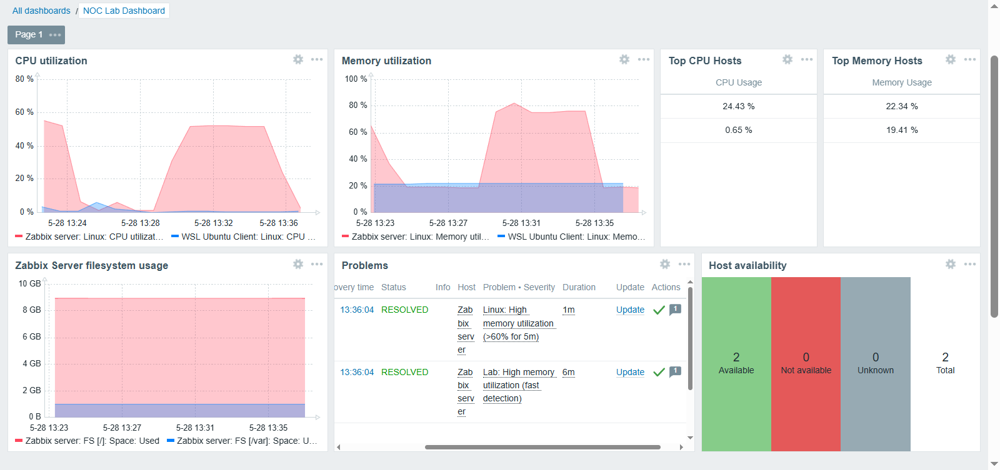

# 📡 Laboratório NOC com Zabbix

Este projeto simula um ambiente básico de **Network Operations Center (NOC)** utilizando ferramentas amplamente empregadas em infraestrutura, monitoramento e automação.

O laboratório foi construído em uma infraestrutura virtualizada com Ubuntu Server e VMware Workstation, integrando **Zabbix**, **Grafana** e **Ansible** para demonstrar um fluxo completo de monitoramento, visualização de métricas, detecção de incidentes e automação operacional.

Além da implementação técnica, todo o processo foi documentado, incluindo decisões de projeto, problemas encontrados e soluções adotadas durante o desenvolvimento do ambiente.

> [!NOTE]
> **Status do Lab:** Concluído ✅

---
# 🎯 Objetivos

- Implementar uma plataforma de monitoramento baseada em Zabbix
- Monitorar hosts, métricas e serviços críticos
- Desenvolver e testar triggers personalizadas
- Criar dashboards operacionais no Zabbix e Grafana
- Simular incidentes para validar o monitoramento
- Automatizar tarefas administrativas com Ansible
- Praticar troubleshooting em ambientes Linux
- Documentar todas as etapas do projeto

---
# 🧱 Tecnologias Usadas

| Tecnologia          | Função                      |
| ------------------- | --------------------------- |
| Ubuntu Server 24.04 | Sistema Operacional         |
| Zabbix 6.4          | Plataforma de monitoramento |
| Grafana             | Visualização de métricas    |
| Ansible             | Automação e gerenciamento   |
| MariaDB             | Banco de dados              |
| Apache2             | Frontend Web                |
| VMware Workstation  | Virtualização               |
| WSL2                | Host Linux adicional        |
| Netplan             | Configuração de rede        |

---
# 📚 Documentação

| Documento                                                        | Descrição                                                                                                    |
| ---------------------------------------------------------------- | ------------------------------------------------------------------------------------------------------------ |
| [01 - Setup Inicial](./docs/01-setup-inicial.md)                 | Configuração inicial da infraestrutura e rede                                                                |
| [02 - Instalação do Zabbix](./docs/02-instalacao-zabbix.md)      | Instalação e configuração do Zabbix Server                                                                   |
| [03 - Monitoramento Parte 1](./docs/03-monitoramento-parte-1.md) | Configuração do primeiro host, criação de triggers e validação do ambiente de monitoramento                  |
| [04 - Monitoramento Parte 2](./docs/04-monitoramento-parte-2.md) | Adição de segundo host, dashboard personalizado, trigger customizada e monitoramento de serviços             |
| [05 - Integração com Grafana](./docs/05-grafana.md)              | Integração entre Grafana e Zabbix, criação de dashboard operacional e validação durante incidentes simulados |
| [06 - Automação com Ansible](./docs/06-ansible.md)               | Criação do inventário e playbooks, automação operacional e validação integrada com Zabbix e Grafana          |

---
# 📸 Screenshots

## Dashboard Global do Zabbix

  

## Dashboard do Zabbix durante teste de estresse de memória

  

## Dashboard do Grafana durante indisponibilidade do Zabbix Agent

	

## Execução do playbook do Ansible interrompendo o Zabbix Agent

  

---

# 📌 Observações

Este projeto foi desenvolvido com finalidade educacional e para compor meu portfólio profissional. Toda a implementação foi realizada em um ambiente controlado, documentando as decisões técnicas, os desafios encontrados e as soluções adotadas durante o desenvolvimento.