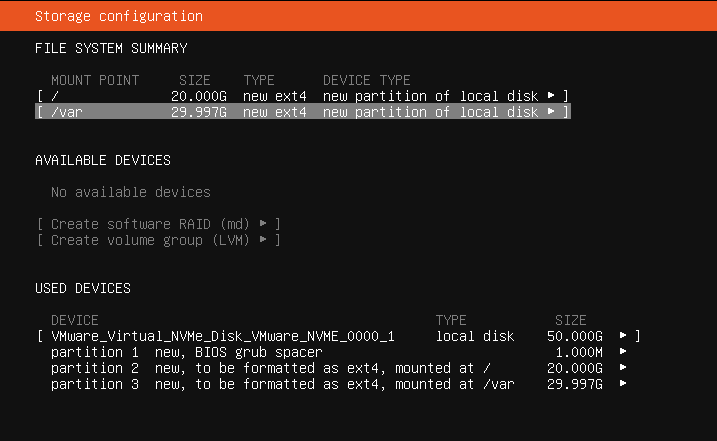
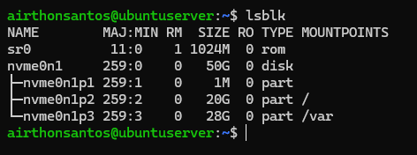
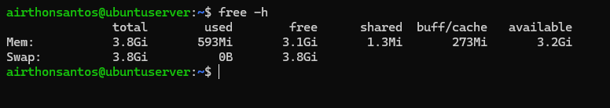
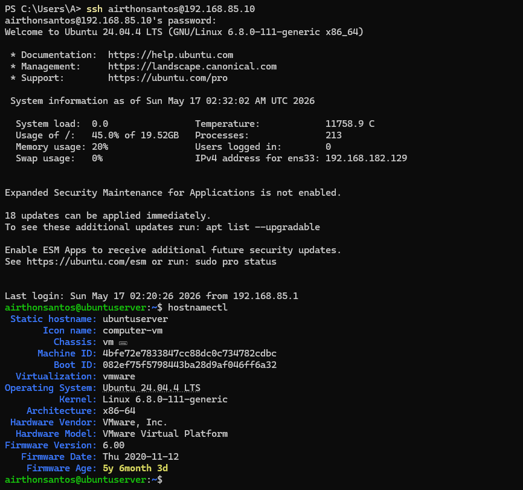
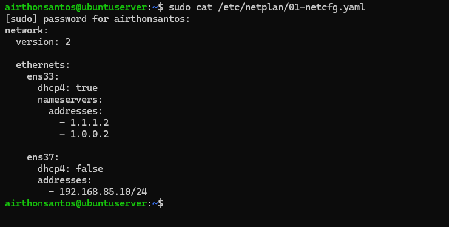

# Setup Inicial do Laboratório

## 🎯 Objetivo

Preparar o ambiente inicial do laboratório de monitoramento utilizando Ubuntu Server em uma máquina virtual no VMware. O objetivo dessa etapa é estabelecer a base da infraestrutura, configurando conectividade entre o host Windows e a VM para permitir acesso remoto via SSH, acesso ao frontend web do Zabbix e comunicação entre futuros hosts monitorados.

---
## 🧱 Ambiente Utilizado

| Componente          | Detalhes                    |
| ------------------- | --------------------------- |
| Sistema Operacional | Ubuntu Server CLI 24.04 LTS |
| Virtualização       | VMware Workstation          |
| Disco Virtual       | NVMe                        |
| Disco               | 50 GB                       |
| Rede                | NAT + Host-only             |

---

## 🧠 Decisões Técnicas

### Uso do Ubuntu Server CLI
Escolhi a versão CLI por ser o padrão usado em ambientes reais, além de consumir menos recursos da máquina.
### Uso de disco NVMe virtual
Mesmo utilizando HD físico no host, selecionei o controlador NVMe por oferecer melhor compatibilidade com sistemas modernos e melhor desempenho virtualizado.
### Disco dinâmico
O disco foi configurado como dinâmico para otimizar o uso de armazenamento no host.
### Particionamento
Usei um disco de 50 GB, onde separei o diretório `/var` da partição raiz (`/`). A ideia foi separar os dados do sistema dos dados gerados pelo Zabbix, principalmente logs e banco de dados, evitando que o crescimento desses arquivos afete diretamente a partição raiz. Além disso, minha ideia inicial era criar um swapfile. Porém, não foi necessário, visto que o próprio sistema criou automaticamente.
### Rede
A configuração de rede foi montada utilizando duas interfaces com funções diferentes. A interface NAT ficou responsável pelo acesso à internet, enquanto a interface Host-only recebeu um IP estático para permitir acesso remoto via SSH entre o host Windows e o Ubuntu Server.

Optei por utilizar IP fixo na interface Host-only para evitar problemas com mudança de endereço IP após reinicializações da VM, além de facilitar futuras etapas do laboratório, principalmente relacionadas ao monitoramento e administração do ambiente.

---
## Configurações Iniciais

### Atualização do sistema e Instalação de ferramentas básicas

```
sudo apt update && sudo apt upgrade -y
sudo apt install -y net-tools curl wget vim htop
```
## Estrutura do particionamento

<p align="center">
	
</p>

<details>
  <summary>📂 Clique aqui para ver a saída dos comandos lsblk e free</summary>

  <br>

  - **Saída do comando `lsblk`**

    <p align="center">
      
    </p>

  - **Saída do comando `free`**

    <p align="center">
      
    </p>

</details>

## Configuração de rede

Utilizei o Netplan para realizar a configuração de rede. O arquivo utilizado foi `/etc/netplan/01-netcfg.yaml`. Inicialmente, a VM estava configurada apenas com uma interface NAT utilizando DHCP. Apesar de funcionar normalmente, isso acabou dificultando o acesso remoto via SSH a partir do host Windows, já que o endereço IP poderia mudar dinamicamente.

Pensando nas próximas etapas do laboratório, principalmente relacionadas ao monitoramento e administração do ambiente, optei por adicionar uma segunda interface Host-only e configurar nela um IP estático, permitindo uma comunicação direta entre o host Windows e o Ubuntu Server.

O arquivo `01-netcfg.yaml` ficou estruturado da seguinte forma:
```yaml
network:
  version: 2
  ethernets:
    ens33:
      dhcp4: true
      nameservers:
        addresses:
          - 1.1.1.2
          - 1.0.0.2
    ens37:
      dhcp4: false
      addresses:
        - 192.168.85.10/24
```

<details>
  <summary>📂 Clique aqui para ver a conexão ssh e o arquivo 01-netcfg.yaml</summary>

  <br>

- **Conexão SSH entre host Windows e Ubuntu Server**

    <p align="center">
      
    </p>

- **Arquivo 01-netcfg.yaml**
    <p align="center">
      
    </p>

</details>

## 📌 Resultado

Ao final dessa etapa, o ambiente inicial do laboratório já contava com:

- Ubuntu Server configurado e atualizado
- conectividade entre host Windows e VM funcionando
- acesso remoto via SSH operacional
- interface NAT com acesso à internet
- interface Host-only configurada com IP estático
- estrutura de rede preparada para futuras etapas de monitoramento
- base pronta para instalação e configuração do Zabbix
