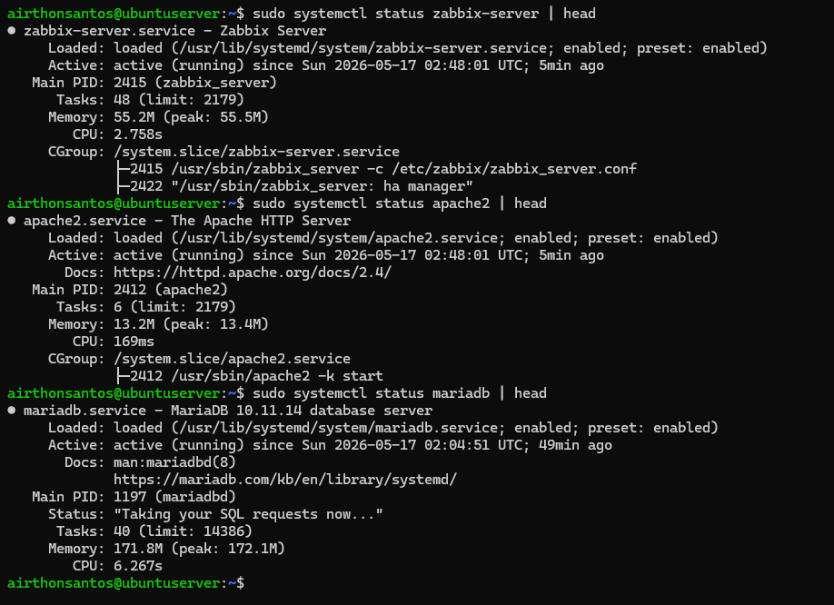

# Instalação do Zabbix Server

## 🎯 Objetivo

Implementar uma plataforma de monitoramento utilizando Zabbix com:
- backend em MariaDB
- frontend web Apache/PHP
- monitoramento via Zabbix Agent

---
## 🧱 Componentes Utilizados

| Componente          | Tecnologia          |
| ------------------- | ------------------- |
| Monitoramento       | Zabbix 6.4          |
| Banco de Dados      | MariaDB             |
| Web Server          | Apache2             |

---
## ⚙️Instalação

Optei por realizar uma instalação manual com o objetivo de entender melhor como o processo funciona:

A instalação foi dividida em quatro etapas principais:
- configuração do banco de dados
- instalação do Zabbix
- ajustes do servidor
- configuração da interface web

### Instalação e Hardening inicial do MariaDB

Como o Zabbix depende de um banco de dados para armazenar métricas, eventos e configurações, o primeiro passo foi instalar o MariaDB.
```bash
sudo apt install mariadb-server -y
```

Na sequência executei o script abaixo, responsável por realizar um hardening inicial no banco de dados, aplicando configurações, como: configurar a senha do root, remoção de usuários anônimos, desativação de root remoto e remoção de banco de testes.
```bash
sudo mysql_secure_installation
```

### Acesso ao banco e criação do Banco do Zabbix

Após acessar o banco de dados, criei o banco do Zabbix, assim como o seu respectivo usuário, além de conceder os devidos privilégios.
```SQL
CREATE DATABASE zabbix CHARACTER SET utf8mb4 COLLATE utf8mb4_bin;

CREATE USER 'zabbix'@'localhost' IDENTIFIED BY 'SENHA_FORTE';

GRANT ALL PRIVILEGES ON zabbix.* TO 'zabbix'@'localhost';

FLUSH PRIVILEGES;
EXIT;
```

<details>
  <summary>📂 Clique aqui para ver a tabela criada no mariadb para o zabbix</summary>

  <br>

- **Tabela do Zabbix**

    <p align="center">
      
    </p>

</details>

### Instalação do Zabbix

#### Adicionando o repositório oficial do Zabbix ao sistema
```shell
wget https://repo.zabbix.com/zabbix/6.4/ubuntu/pool/main/z/zabbix-release/zabbix-release_latest_6.4+ubuntu24.04_all.deb
sudo dpkg -i zabbix-release_latest_6.4+ubuntu24.04_all.deb
sudo apt update
```
#### Instalação dos componentes
```bash
sudo apt install -y \
zabbix-server-mysql \
zabbix-frontend-php \
zabbix-apache-conf \
zabbix-sql-scripts \
zabbix-agent
```
#### Importando schema
Depois da instalação dos pacotes, foi necessário importar a estrutura inicial do banco de dados do Zabbix para dentro do banco criado anteriormente.
```bash
zcat /usr/share/zabbix-sql-scripts/mysql/server.sql.gz | mysql -u zabbix -p zabbix
```

---
### Configuração do Zabbix Server

Agora tive que configurar o arquivo `/etc/zabbix/zabbix_server.conf`, incluindo a senha do banco de dados criado antes. Para isso alterei a linha abaixo:

```bash
DBPassword=senha
```

Um problema aqui é o hardcoding, então a forma que usei para proteger esse arquivo foi por meio das permissões. Dessa forma tranquei o arquivo para que apenas o usuário do sistema `zabbix` e o `root` pudessem lê-lo.

```shell
sudo chown root:zabbix /etc/zabbix/zabbix_server.conf
sudo chmod 640 /etc/zabbix/zabbix_server.conf
```

### Configuração do Apache/PHP

Durante a instalação do frontend, a configuração do timezone gerou dúvidas porque a linha padrão não existia mais no arquivo `apache.conf`. Foi então que descobri que a linha de timezone não vem mais por padrão em algumas versões. Por isso tive que realizar a configuração manual do timezone no Apache/PHP para alinhar o relógio interno da interface web do Zabbix com o fuso horário local, sem essa definição podem ocorrer inconsistências de horário no frontend, problemas na correlação de eventos e dificuldades na análise de alertas. O que acaba por atrapalhar o processo de resposta a incidentes.

Portanto, nesse arquivo adicionei a linha abaixo entre as tags `IfModule mod_php.c`.
```
php_value date.timezone America/Sao_Paulo
```

### Acessando a interface front-end do Zabbix

Antes de acessar a interface, verifiquei se todos os principais componentes estavam em execução, como: Zabbix-server, Apache2 e o MariaDB.

<details>
  <summary>📂 Clique aqui para ver a verificação desses serviços</summary>
  <br>

- **Status dos serviços do Zabbix, Apache2 e MariaDB**

    <p align="center">
      
    </p>
</details>

Após isso acessei o front-end do Zabbix no navegador, comprovando que todo o processo funcionou corretamente.

<p align="center">
      
</p>

## 📌 Resultado

Ao final dessa etapa, o ambiente já estava operacional, com:
- banco de dados configurado
- frontend web acessível
- serviços principais em execução
- Zabbix Server funcionando corretamente