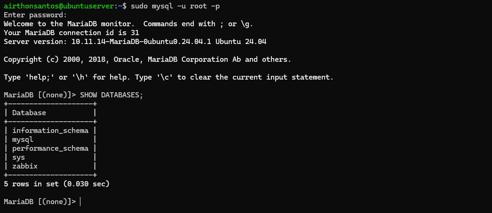
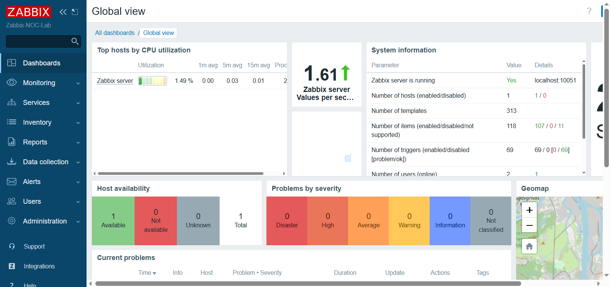

# Instalação do Zabbix Server

## 🎯 Objetivo

O objetivo desta etapa foi implantar a plataforma de monitoramento do laboratório utilizando o Zabbix, configurando o banco de dados, a interface web e os componentes responsáveis pela coleta de métricas.

---
## ⚙️Instalação

Optei por realizar uma instalação manual para compreender melhor cada etapa do processo de implantação do Zabbix. A documentação a seguir apresenta as etapas que realizei durante a instalação e configuração do ambiente.

### Instalação e Hardening inicial do MariaDB

Como o Zabbix depende de um banco de dados para armazenar métricas, eventos e configurações, o primeiro passo foi instalar o MariaDB.
```bash
sudo apt install mariadb-server -y
```

Em seguida, executei o script abaixo para aplicar uma configuração inicial de segurança na base de dados. Esse procedimento inclui etapas como a definição da senha do usuário root, remoção de usuários anônimos, desativação do acesso remoto do root e exclusão do banco de testes.
```bash
sudo mysql_secure_installation
```

### Criação do banco de dados do Zabbix

Após acessar o MariaDB, criei a base de dados utilizada pelo Zabbix, o usuário responsável pelo acesso a ela e os privilégios necessários para seu funcionamento.
```SQL
CREATE DATABASE zabbix CHARACTER SET utf8mb4 COLLATE utf8mb4_bin;

CREATE USER 'zabbix'@'localhost' IDENTIFIED BY 'SENHA_FORTE';

GRANT ALL PRIVILEGES ON zabbix.* TO 'zabbix'@'localhost';

FLUSH PRIVILEGES;
EXIT;
```

<details>
  <summary>📂 Clique aqui para ver a tabela criada no mariadb para o zabbix</summary>
  <br>

- **Tabela do Zabbix**
    <p align="center">
      
    </p>

</details>

### Instalação do Zabbix

#### Adicionando o repositório oficial do Zabbix ao sistema
```shell
wget https://repo.zabbix.com/zabbix/6.4/ubuntu/pool/main/z/zabbix-release/zabbix-release_latest_6.4+ubuntu24.04_all.deb
sudo dpkg -i zabbix-release_latest_6.4+ubuntu24.04_all.deb
sudo apt update
```
#### Instalação dos componentes
```bash
sudo apt install -y \
zabbix-server-mysql \
zabbix-frontend-php \
zabbix-apache-conf \
zabbix-sql-scripts \
zabbix-agent
```
#### Importando schema
Após a instalação dos pacotes, foi necessário importar o schema inicial do Zabbix para a base de dados criada anteriormente.
```bash
zcat /usr/share/zabbix-sql-scripts/mysql/server.sql.gz | mysql -u zabbix -p zabbix
```

---
### Configuração do Zabbix Server

O próximo passo foi configurar o arquivo `/etc/zabbix/zabbix_server.conf`, informando a senha usada pelo usuário do banco de dados.

```ini
DBPassword=senha
```

Um ponto que me chamou atenção nessa etapa foi a presença de um **hardcoded secret**, já que a senha do banco de dados precisa ser armazenada diretamente no arquivo de configuração. Para reduzir a exposição dessa informação, restringi as permissões do arquivo para que apenas o usuário `root` e o grupo `zabbix` pudessem acessá-lo.

```bash
sudo chown root:zabbix /etc/zabbix/zabbix_server.conf
sudo chmod 640 /etc/zabbix/zabbix_server.conf
```

### Configuração do Apache/PHP

Durante a instalação do frontend, a configuração do timezone gerou dúvidas porque a linha padrão não existia mais no arquivo `apache.conf`. Após investigar o comportamento, descobri que algumas versões não incluem essa configuração por padrão. Por esse motivo, adicionei manualmente a definição de timezone no Apache/PHP para alinhar o relógio interno do Zabbix ao fuso horário local. Sem essa configuração, podem ocorrer inconsistências nos horários exibidos pela interface, dificultando a análise de eventos e alertas.

Portanto, nesse arquivo adicionei a linha abaixo entre as tags `IfModule mod_php.c`.
```ini
php_value date.timezone America/Sao_Paulo
```

### Acessando a interface front-end do Zabbix

Antes de acessar a interface web, verifiquei se os principais componentes estavam em execução: Zabbix Server, Apache2 e MariaDB.

<details>
  <summary>📂 Clique aqui para ver a verificação desses serviços</summary>
  <br>

- **Status dos serviços do Zabbix, Apache2 e MariaDB**
    <p align="center">
      
    </p>
</details>

Com os serviços em execução, acessei a interface web do Zabbix e confirmei que a instalação e a integração entre os componentes haviam sido concluídas com sucesso. A imagem abaixo mostra o Dashboard Global View do Zabbix.
<p align="center">
      
</p>

## 📌 Resultado

Ao final desta etapa, o ambiente já estava operacional, com:

- Banco de dados configurado
- Interface web acessível
- Serviços principais em execução
- Zabbix Server integrado e funcional