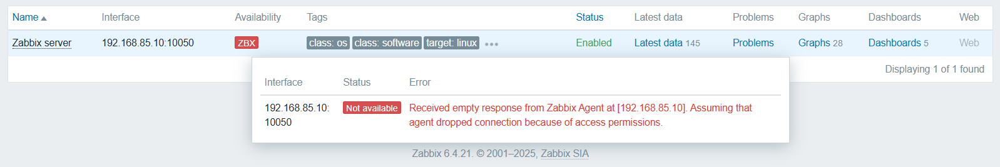
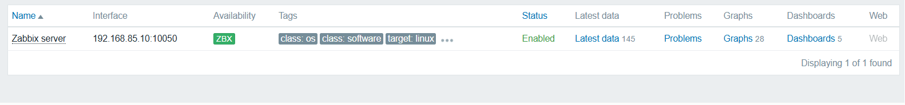
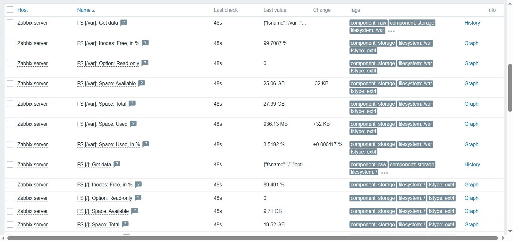
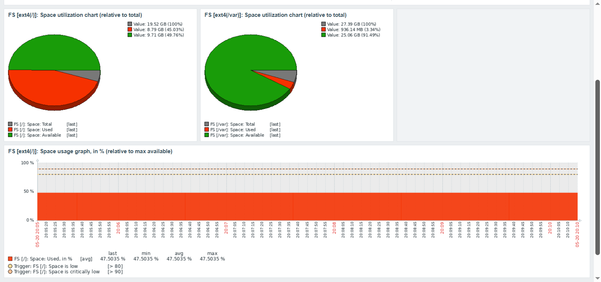
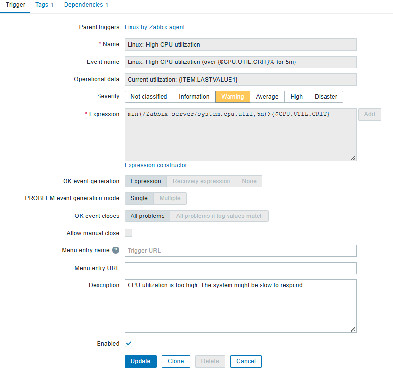
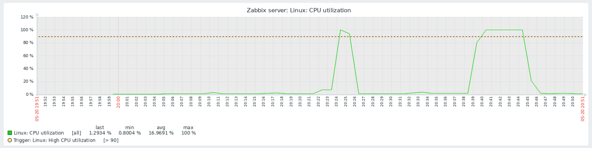
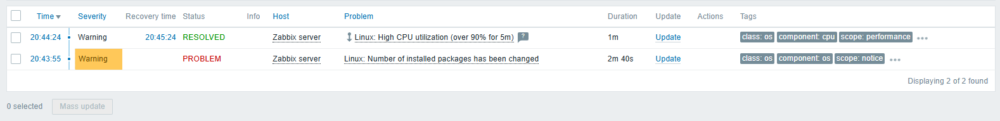
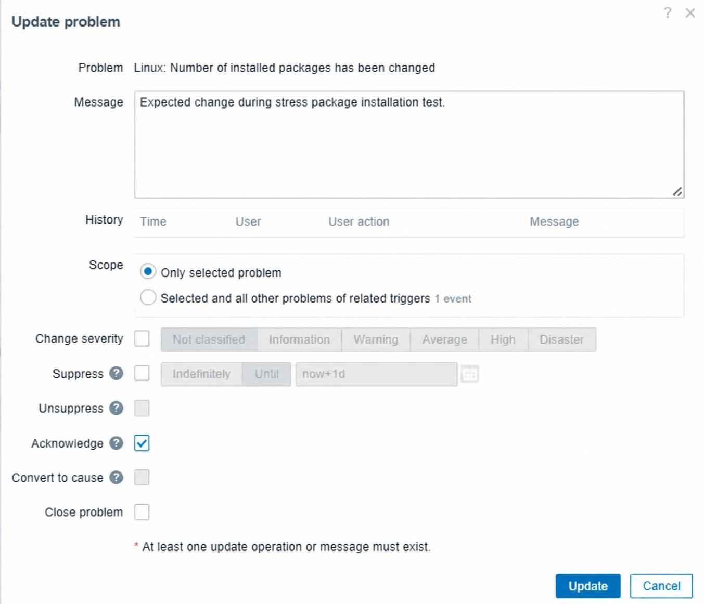
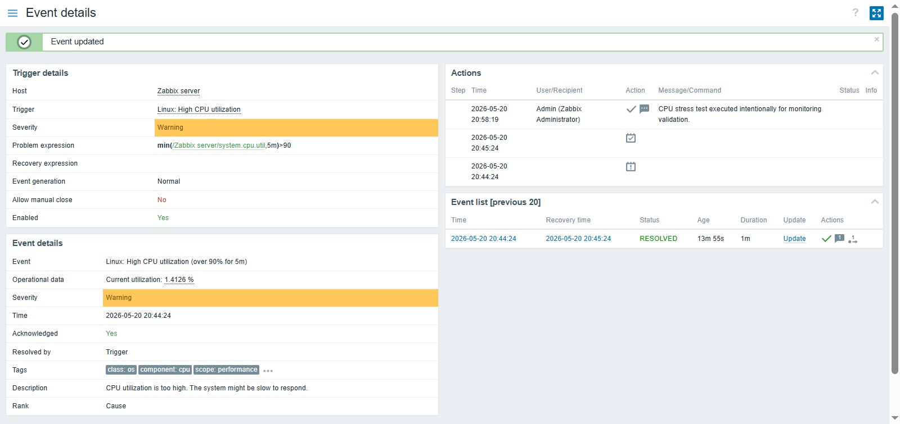

# Monitoramento - Parte 1

## 🎯 Objetivo

O objetivo desta etapa foi estabelecer a base do ambiente de monitoramento, configurando o primeiro host do laboratório e validando o fluxo completo de coleta, processamento e visualização de métricas.

## ⚙️ Configuração do Zabbix Agent no próprio Zabbix Server
Como primeiro host, optei por usar o próprio Zabbix Server. Dessa forma seria possível validar toda a cadeia de monitoramento antes de adicionar novos hosts ao ambiente.

Comecei editando o arquivo `zabbix_agentd.conf`. Inicialmente não conhecia muito bem as formas de monitoramento do Zabbix, então optei por usar uma configuração híbrida, que me permitia usar tanto o passivo quanto ativo. Nesse modelo, o agente pode tanto responder a consultas do servidor (modo passivo) quanto enviar informações por iniciativa própria (modo ativo).

Dessa forma, a configuração que adotei foi:
```ini
Server=127.0.0.1,192.168.85.10
ServerActive=127.0.0.1
Hostname=Zabbix server
```
### Problemas encontrados
Durante a configuração tive dois problemas principais. O primeiro deles foi o hostname. Após algumas tentativas, identifiquei que o valor definido em `Hostname` no arquivo `zabbix_agentd.conf` precisa corresponder ao nome configurado para o host no frontend do Zabbix. Caso contrário, o servidor não consegue associar os dados recebidos ao host cadastrado.

O segundo problema envolvia a diretiva `Server`. Mesmo com o Zabbix Agent em execução, o host permanecia com o status "Not Available" no frontend. Após analisar a configuração, identifiquei que, no monitoramento passivo, o agente só aceita conexões dos endereços IP definidos nesse parâmetro. Como o endereço usado pelo servidor não estava corretamente configurado, as conexões eram recusadas pelo agente.

<details>
  <summary>📂 Clique aqui para ver o erro de "Not Available"</summary>
  <br>
    <p align="center">
      
    </p>
</details>

### Configuração final

Após entender melhor a diferença entre eles, decidi manter apenas o monitoramento passivo para esse host. Como o próprio Zabbix Server e o Agent estão na mesma máquina, não existe preocupação com conectividade de rede, regras de firewall ou mudanças de endereçamento IP.

A configuração final foi:
```ini
Server=127.0.0.1,192.168.85.10
Hostname=Zabbix server
```
Removi o parâmetro `ServerActive` para que o agente operasse exclusivamente em modo passivo. Também atualizei os parâmetros do host no frontend para que correspondessem aos valores definidos no agente.

Após a correção das configurações, o host passou a responder normalmente às consultas do Zabbix Server. Isso permitiu validar todo o fluxo de monitoramento, desde a coleta das métricas pelo Agent até o armazenamento no banco de dados e a exibição das informações no frontend.

<p align="center">
  
</p>

Todas as métricas exibidas abaixo foram criadas automaticamente pelo template padrão `Linux by Zabbix agent`, responsável por disponibilizar diversos itens de monitoramento sem a necessidade de configuração manual.

<details>
  <summary>📂 Clique aqui para ver as métricas e os gráficos</summary>
  <br>

- **Métricas criadas pelo Template "Linux by Zabbix agent"**
    <p align="center">
      
    </p>

- **Gráficos do Zabbix**
	<p align="center">
      
    </p>

</details>

## Validação de Triggers
Minha ideia inicial era criar triggers personalizadas. Mas antes disso, decidi validar o funcionamento do ambiente usando algumas triggers já fornecidas pelo template padrão, como a `High CPU utilization`.

<p align="center">
  
</p>

Para simular uma condição de alto consumo de CPU, usei o utilitário `stress`, uma ferramenta capaz de gerar carga artificial sobre os recursos do sistema. O objetivo era reproduzir um cenário que satisfizesse as condições da trigger e observar seu comportamento.

O teste foi executado durante 6 minutos (360 segundos), conforme o comando abaixo:
```bash
stress --cpu 2 --timeout 360
```

Após a execução, o dashboard do Zabbix registrou o aumento no consumo de processamento:
<p align="center">
      
</p>
É possível observar dois picos no gráfico. O primeiro corresponde a um teste anterior que executei por apenas dois minutos, tempo insuficiente para satisfazer a condição definida pela trigger.  O segundo corresponde ao teste de seis minutos realizado antes. Essa duração foi escolhida para superar a janela de cinco minutos usada pela trigger padrão, permitindo validar seu acionamento.


Durante os testes, o Zabbix identificou não só o alto consumo de processamento, mas também alterações na lista de pacotes instalados após a instalação do utilitário `stress`.

<p align="center">
      
</p>

Após a validação dos alertas, os eventos foram reconhecidos manualmente por meio do mecanismo de acknowledge do Zabbix, simulando o fluxo operacional normalmente executado por equipes de monitoramento.

<details>
  <summary>📂 Clique aqui para ver o Acknowledge das Triggers </summary>
  <br>

- **Trigger do alto uso de CPU**
    <p align="center">
      
    </p>

- **Trigger de mudança do sistema**
	<p align="center">
      
    </p>

</details>

A imagem abaixo mostra os detalhes do evento após o reconhecimento (acknowledge). É possível visualizar a expressão usada pela trigger, que verifica se o menor valor do uso de CPU nos últimos cinco minutos permanece acima de 90%. Como a carga gerada pelo utilitário `stress` manteve o uso acima desse limite durante todo o intervalo, a trigger foi acionada corretamente.

<p align="center">
      
</p>

Com o monitoramento básico validado, a próxima etapa será a expansão do ambiente com novos hosts e a criação de mecanismos mais avançados de monitoramento e alerta.

## 📌 Resultado

Ao final desta etapa, o ambiente de monitoramento estava operacional e validado por meio de testes práticos e incidentes simulados.

Durante essa fase foram abordados os seguintes tópicos:

- Instalação e configuração do Zabbix Agent
- Resolução de problemas de comunicação entre Agent e Server
- Validação da coleta de métricas
- Simulação de incidentes usando carga artificial
- Teste e análise de triggers predefinidas
- Reconhecimento e tratamento de eventos (acknowledge)