# Monitoramento - Parte 2

## 🎯 Objetivo

O objetivo desta etapa foi expandir o ambiente de monitoramento, ao adicionar um segundo host ao laboratório, criar dashboard personalizado, desenvolver trigger própria e implementar o monitoramento de serviços.

## Adicionando segundo host

Para o segundo host monitorado, optei por usar o WSL. Além de ser uma solução leve, ele permitiu expandir o laboratório sem a necessidade de criar uma nova máquina virtual. Embora algumas métricas e serviços funcionem de maneira diferente em relação a uma VM tradicional, o WSL foi suficiente para validar a comunicação entre múltiplos hosts e o Zabbix Server.

Primeiro tive que me certificar que havia conexão entre o WSL e a VM (Zabbix Server), para isso realizei um ping entre eles.

<details>
  <summary>📂 Clique aqui para ver o comando ping</summary>
  <br>
    <p align="center">
      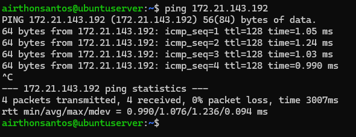
    </p>
</details>

### Problema de comunicação com o WSL
Após instalar o Zabbix Agent no WSL, o host não conseguia ser monitorado pelo Zabbix Server. Ao analisar os logs do agente, identifiquei que as conexões estavam sendo recusadas:

<details>
  <summary>📂 Clique aqui para ver os logs do Zabbix Agent</summary>
  <br>
    <p align="center">
      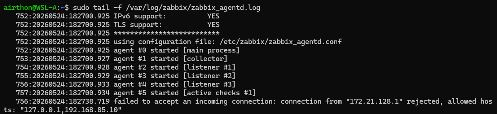
    </p>
</details>

O log mostrava que a conexão não chegava usando o endereço da VM Zabbix (`192.168.85.10`), mas sim através do endereço `172.21.128.1`.

Após investigar o comportamento, identifiquei que o Windows atua como intermediário entre a VM e o WSL através de uma NAT interna. Basicamente, o Windows atua como um gateway entre eles. Por esse motivo, o agente não enxergava a conexão como originada da VM, mas sim da interface NAT interna do Windows.
### Alteração para monitoramento ativo
Embora fosse possível ajustar o parâmetro `Server` para permitir a rede NAT interna do WSL (`172.21.0.0/16`), preferi usar apenas o monitoramento ativo. Porque assim elimino a dependência de conexões iniciadas pelo servidor e evito problemas relacionados à mudança dinâmica de IP no WSL.

A configuração final ficou:
```ini
ServerActive=192.168.85.10
Hostname=WSL-Ubuntu
```

Após ajustar essa configuração do agente, o host passou a ser monitorado corretamente pelo Zabbix Server. Com as métricas já sendo coletadas dos dois hosts, o próximo passo foi criar uma visualização consolidada dessas informações.
## Criação do Dashboard personalizado

Com esse objetivo, criei um dashboard personalizado contendo widgets e gráficos relacionando o Zabbix Server e o WSL. A única exceção foi o gráfico do sistema de arquivos. Como o WSL não disponibiliza as mesmas métricas de armazenamento presentes na VM, usei apenas as métricas do Zabbix Server para essa visualização.
<p align="center">
	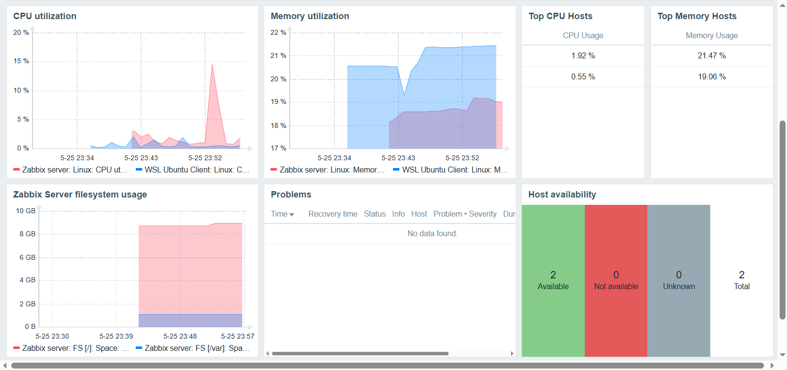
</p>

## Trigger personalizada

### Criação da trigger

Além da trigger padrão fornecida pelo template, criei uma trigger personalizada chamada "Lab: High Memory utilization (fast detection)". Nela usei a seguinte expressão:
```zabbix
last(/Zabbix server/vm.memory.utilization)>60
```

A ideia é que sempre que a última coleta de dados da métrica de uso de memória for maior que 60%, isso gerará um evento com severidade média.

<details>
  <summary>📂 Clique aqui para ver a configuração e validação da trigger</summary>
  <br>

- **Criação da trigger**
    <p align="center">
      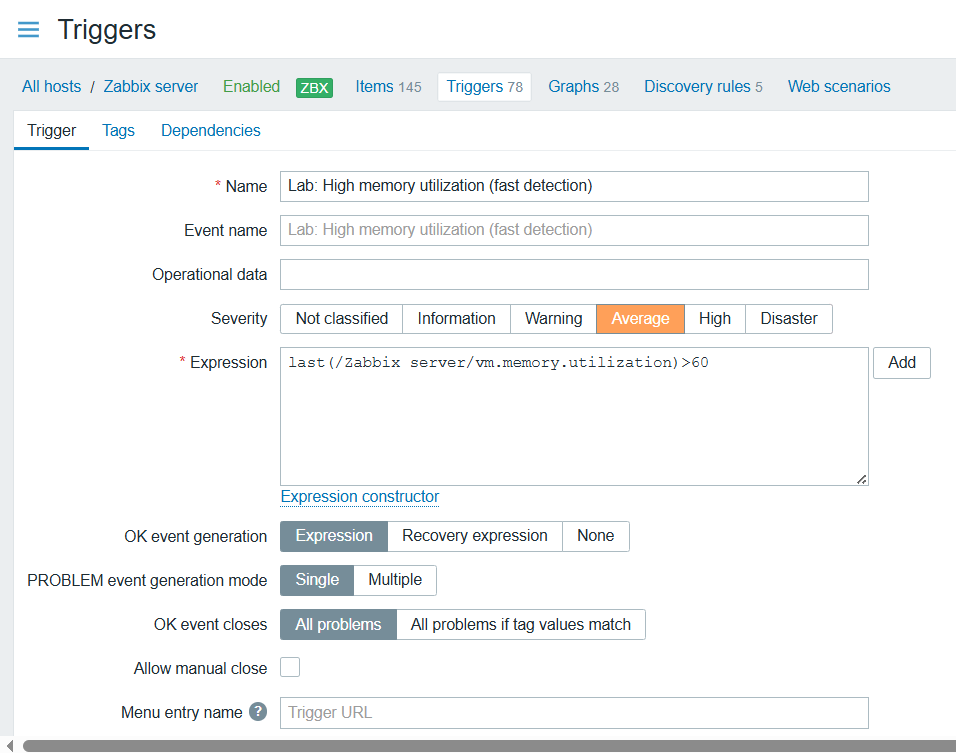
    </p>

- **Validação da trigger**
    <p align="center">
      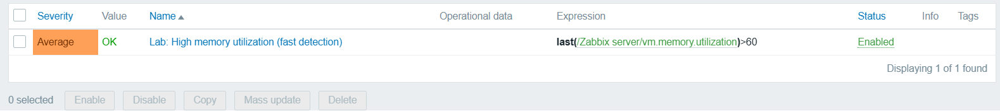
    </p>

</details>

Também alterei o macro `$MEMORY.UTIL.MAX` de 90% para 60% para facilitar os testes. Assim foi possivel acionar tanto a trigger padrão quanto a personalizada sem precisar gerar uma carga excessiva de memória. Além disso, essa abordagem permitiu preservar a trigger original e modificar seu comportamento sem realizar alterações no template oficial.
### Teste da trigger

Para validar o comportamento da trigger, usei a ferramenta `stress-ng`, semelhante ao utilitário `stress` usado anteriormente nos testes de CPU. Neste caso, o objetivo foi simular um cenário de alto consumo de memória para verificar o acionamento da trigger.
```bash
stress-ng --vm 1 --vm-bytes 2G --timeout 360s
```

### Problema encontrado

No entanto, encontrei um problema durante a execução desse comando. O `stress-ng` não mantém os 2 GB de memória em uso constante, apresentando oscilações devido ao próprio comportamento da ferramenta. Essa oscilação foi suficiente para impedir o acionamento da trigger padrão, pois sua expressão utiliza a função `min(...,5m)`. Na prática, isso significa que o consumo de memória precisa permanecer acima do limite configurado durante toda a janela de cinco minutos. Caso o valor fique abaixo desse limite em qualquer momento, a condição é invalidada e a trigger não é acionada.

A imagem abaixo mostra as oscilações de memória geradas pelo `stress-ng`, evidenciando as quedas de uso que impediam o acionamento da trigger padrão.
<p align="center">
  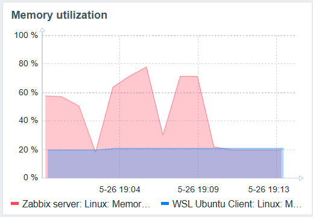
</p>

### Correção

Para eliminar as oscilações observadas antes, adicionei o parâmetro `--vm-keep`, que força o `stress-ng` a manter a memória alocada durante toda a execução do teste. Assim o consumo permanece acima do limite configurado pelo tempo necessário.
```bash
stress-ng --vm 1 --vm-bytes 2200M --vm-keep --timeout 360s
```

### Comparação entre trigger padrão e personalizada
Após a alteração, o consumo de memória permaneceu estável durante toda a execução do teste, permitindo o acionamento tanto da trigger padrão quanto a personalizada.

A imagem abaixo mostra o pico de uso de memória e os eventos gerados por cada uma das triggers.
<p align="center">
	
</p>

Esse teste evidenciou a diferença de comportamento entre as duas abordagens. A trigger padrão do `Linux by Zabbix agent` possui um perfil mais conservador, exigindo que a condição permaneça ativa por vários minutos antes de gerar um evento. Isso reduz a probabilidade de falsos positivos causados por oscilações momentâneas. Enquanto a trigger personalizada reagiu imediatamente ao aumento do consumo de memória, o que a torna mais sensível a essas oscilações e, consequentemente, mais propensa a falsos positivos.

## Monitorando serviços
Em seguida, o objetivo foi testar o monitoramento de alguns serviços, como o próprio Zabbix Agent e o SSH.
### Monitorar indisponibilidade do Zabbix-agent
O template `Linux by Zabbix agent` inclui mecanismos que permitem identificar automaticamente a indisponibilidade do agente e acionar eventos de perda de monitoramento.

Para validar esse comportamento, interrompi manualmente o serviço do agente, simulando um cenário de falha onde o host deixa de responder às verificações realizadas pelo Zabbix.
```bash
sudo systemctl stop zabbix-agent
```

Após a geração do evento, iniciei novamente o serviço para verificar o processo de recuperação automática.
```bash
sudo systemctl start zabbix-agent
```

<details>
  <summary>📂 Clique aqui para ver a detecção da indisponibilidade e recuperação do Zabbix Agent</summary>
  <br>

- **Evento gerado pela parada do Zabbix Agent**
    <p align="center">
      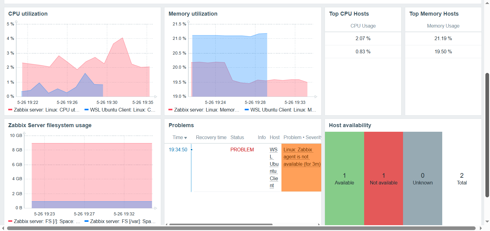
    </p>

- **Evento resolvido após a inicialização do Zabbix Agent**
    <p align="center">
      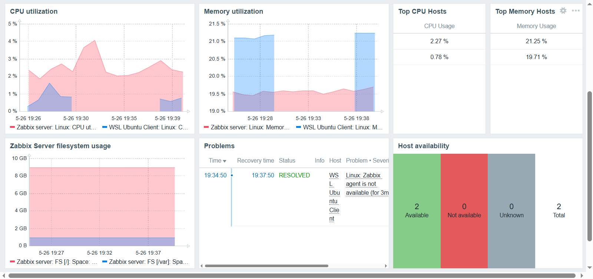
    </p>

</details>

### Monitorar SSH

Para monitorar o SSH, foi necessário criar um item e uma trigger. O item foi configurado para verificar periodicamente a disponibilidade do serviço SSH através da porta TCP 22.

<details>
  <summary>📂 Clique aqui para ver a criação do Item e da Trigger</summary>
  <br>

- **Criação do Item para o SSH**
    <p align="center">
      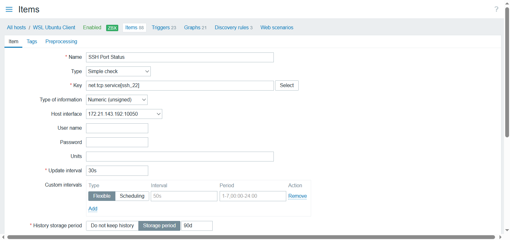
    </p>

- **Criação da Trigger para o SSH**
    <p align="center">
      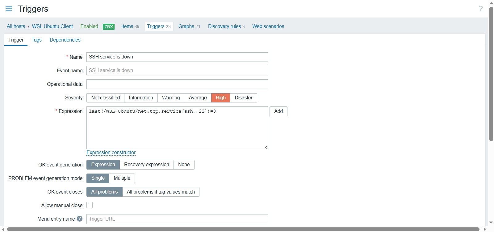
    </p>

</details>

Com o item e a trigger configurados, realizei um teste prático para validar o monitoramento. Para isso, interrompi manualmente os serviços responsáveis pelo SSH, simulando um cenário de indisponibilidade do acesso remoto ao host.
```bash
sudo systemctl stop ssh.socket ssh.service
```

Após a geração do evento, restabeleci o serviço SSH para validar o processo de recuperação automática.
```bash
sudo systemctl start ssh.socket ssh.service
```

Assim que a porta TCP 22 voltou a responder, o Zabbix identificou a recuperação do serviço e encerrou automaticamente o evento aberto antes.

<details>
  <summary>📂 Clique aqui para ver a detecção da indisponibilidade e recuperação do SSH</summary>
  <br>

- **Evento gerado pela indisponibilidade do serviço SSH**
    <p align="center">
      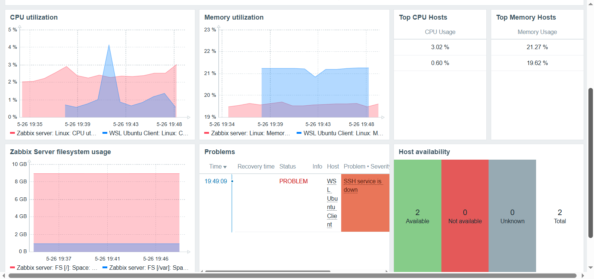
    </p>

- **Evento resolvido após o restabelecimento do serviço SSH**
    <p align="center">
      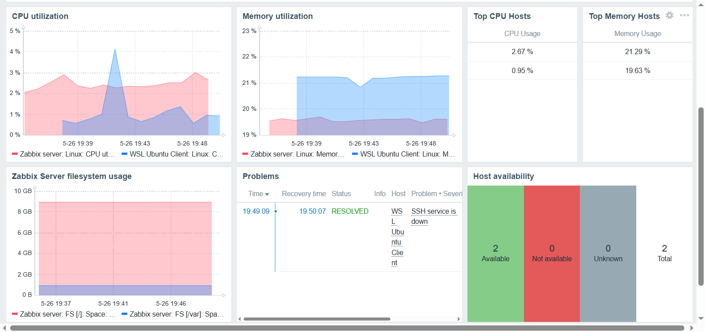
    </p>

</details>

Ao final dessa etapa, o laboratório passou a monitorar múltiplos hosts e serviços, se aproximando de um cenário mais realista de operações e permitindo validar não apenas métricas de infraestrutura, mas também a disponibilidade de serviços.

A etapa seguinte será focada na integração com o Grafana para visualização de métricas e no uso do Ansible para automação de tarefas.

## 📌 Resultado

Ao final desta etapa, o ambiente de monitoramento foi expandido e validado com sucesso.

Durante essa fase foram abordados os seguintes tópicos:

- Adição de um segundo host ao ambiente (WSL)
- Configuração do Zabbix Agent no WSL em modo ativo
- Resolução de problemas de comunicação entre VM, Windows e WSL
- Criação de dashboard personalizado
- Desenvolvimento e validação de trigger personalizada (Trigger Tuning)
- Monitoramento de serviços críticos

