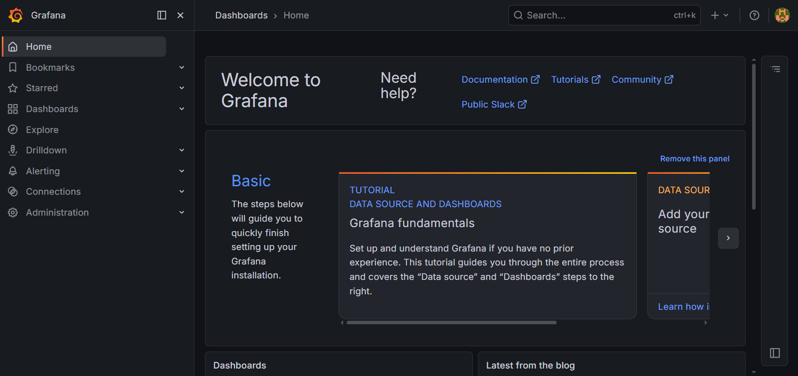
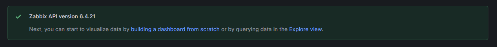
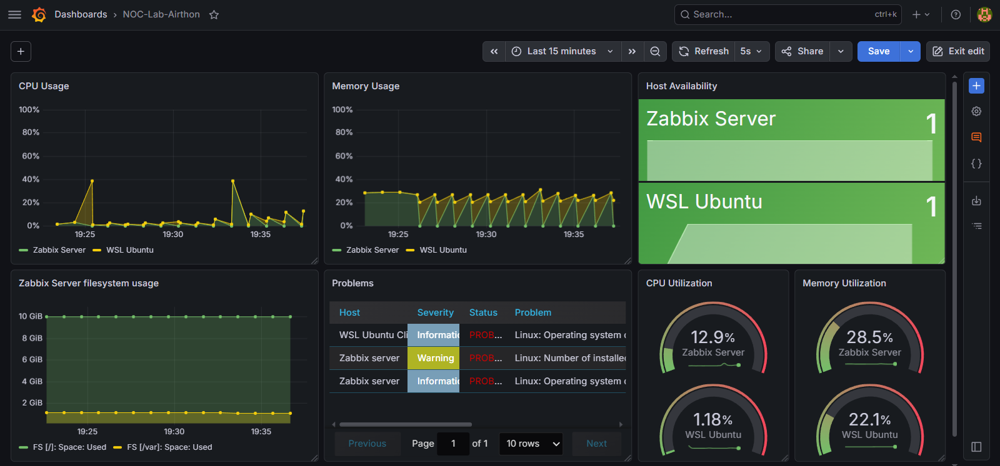
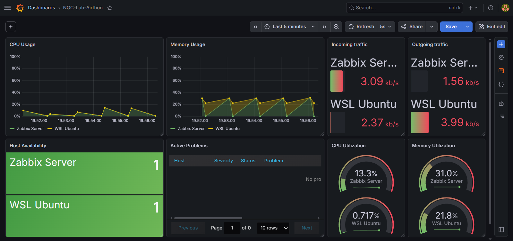
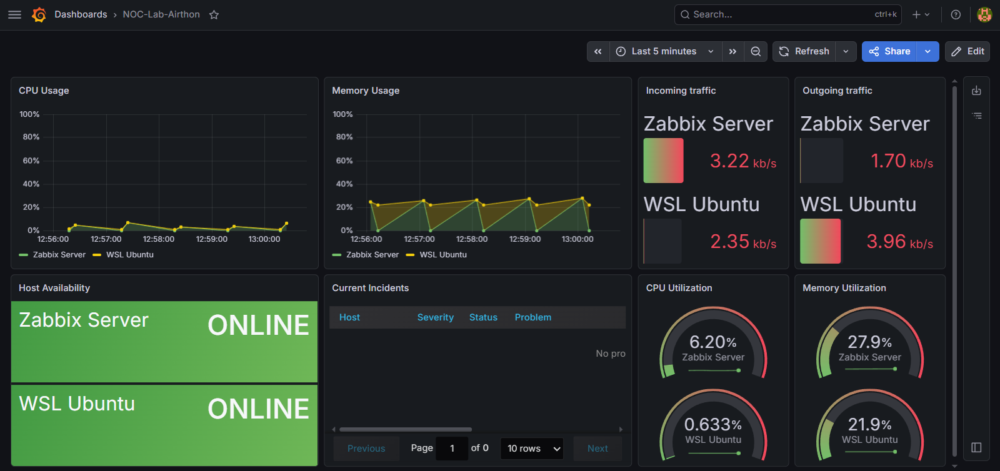
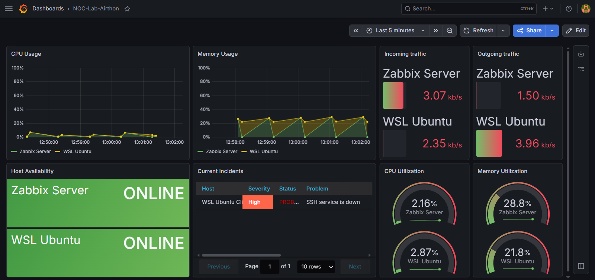
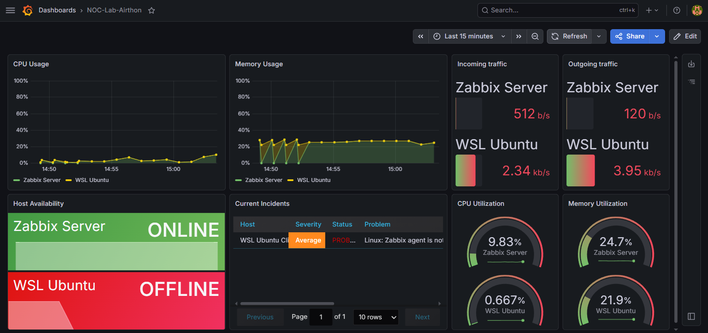
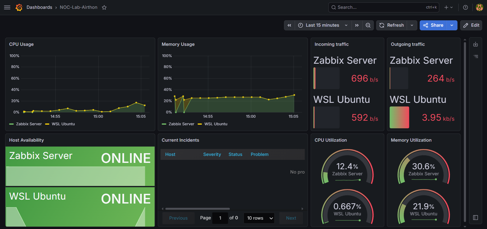

# Integração do Grafana

## 🎯 Objetivos

O objetivo desta etapa foi integrar o Grafana ao ambiente já existente, criar dashboard personalizado e validar a visualização das métricas e incidentes gerados pelo Zabbix.

## ⚙️Instalação

A instalação do Grafana foi realizada usando o repositório oficial do projeto. O processo envolveu a instalação das dependências necessárias, a adição do repositório ao sistema e, posteriormente, a instalação da aplicação.

O primeiro passo foi instalar os pacotes necessários para habilitar a comunicação segura com repositórios externos.
```bash
sudo apt install -y apt-transport-https software-properties-common wget
```

Em seguida, baixei a chave GPG do repositório oficial e adicionei o repositório do Grafana à lista de fontes do Ubuntu Server.
```bash
wget -q -O - https://apt.grafana.com/gpg.key | sudo gpg --dearmor -o /usr/share/keyrings/grafana.gpg
echo "deb [signed-by=/usr/share/keyrings/grafana.gpg] https://apt.grafana.com stable main" | sudo tee /etc/apt/sources.list.d/grafana.list
```

Por fim, atualizei a lista de pacotes e realizei a instalação do Grafana.
```bash
sudo apt update
sudo apt install grafana -y
```

Após a instalação, acessei a interface web do Grafana pelo navegador usando o endereço IP do servidor (`192.168.85.10`) na porta padrão `3000`, validando que a aplicação estava funcionando corretamente.

<details>
  <summary>📂 Clique aqui para ver a tela inicial do grafana</summary>
  <br>

- **Tela inicial do Grafana**
    <p align="center">
      
    </p>

</details>

## Instalação do Plugin do Zabbix

Embora a instalação do plugin oficial do Zabbix pudesse ser realizada pela interface gráfica, optei por executá-la via terminal.

```bash
sudo grafana cli plugins install alexanderzobnin-zabbix-app
```

Com o plugin instalado, o próximo passo foi configurar a integração entre o Grafana e o Zabbix.

## Configuração do Data Source

Para realizar essa integração, foi necessário configurar o Zabbix como fonte de dados (Data Source) do Grafana. Para isso, defini a URL da API do Zabbix e as credenciais necessárias para autenticação.

Essa integração permite que o Grafana consulte as métricas já coletadas pelo Zabbix e as utilize na construção dos dashboards. Ao final da configuração, a notificação abaixo confirma que a comunicação entre as duas ferramentas foi estabelecida com sucesso.

<p align="center">
	
</p>

## Construção do Dashboard

Com a integração concluída, comecei a construir o dashboard.

O objetivo inicial era reproduzir no Grafana as principais métricas já acompanhadas no Zabbix. Para isso, comecei criando painéis relacionados ao uso de CPU, memória e sistema de arquivos.

Como o Grafana oferece vários tipos de visualização, optei por usar o painel `Time Series`, por ser o mais semelhante aos gráficos disponibilizados pelo Zabbix. A criação de cada painel envolveu a seleção do grupo, do host e das métricas que seriam exibidas.

Durante a construção do primeiro gráfico, percebi que a legenda exibia o nome da métrica em vez do nome do host, o que dificultava sua identificação. Para corrigir esse comportamento, usei a função `setAlias`, que me permitiu identificar cada host de forma mais clara.

Outro painel adicionado foi o de disponibilidade dos hosts (`Host Availability`). Tive algumas duvidas sobre qual visualização usar por conta da grande variedade de opções disponíveis. Após alguns testes, escolhi o painel do tipo `Stat`, pois ele apresenta a informação de forma mais simples e objetiva.

Para a visualização dos incidentes, usei o painel nativo `Zabbix Problems`, disponibilizado pelo próprio plugin do Zabbix. Esse recurso exibe automaticamente os eventos e problemas detectados pelo Zabbix, o que facilita o acompanhamento do ambiente.

Já para os painéis de uso percentual da CPU e da memória, optei pelo gráfico do tipo `Gauge`, pois ele se adaptou bem ao restante do dashboard e facilitou a visualização rápida dessas métricas.

Após isso, essa foi a primeira versão do grafico:
<p align="center">
	
</p>

Com a primeira versão concluída, comecei a pensar em possíveis melhorias.

Um dos painéis que mais me incomodava era o gráfico do sistema de arquivos. Apesar de ser uma informação importante, percebi que ele não estava agregando muito ao ambiente. Por esse motivo, decidi substituí-lo por métricas relacionadas ao tráfego de rede, tanto de entrada quanto de saída, que oferecem uma visão mais útil do comportamento dos hosts. Também aproveitei esse momento para reorganizar a disposição dos painéis, tornando a visualização mais intuitiva.

Após essas alterações, o dashboard passou a apresentar a seguinte estrutura:
<p align="center">
	
</p>

Além da reorganização dos painéis, também realizei alguns ajustes visuais para melhorar a legibilidade do dashboard. No painel `Host Availability`, usei o recurso `Value Mapping` para substituir os valores `0` e `1` por `OFFLINE` e `ONLINE`, respectivamente. Também renomeei o painel `Active Problems` para `Current Incidents` e reduzi o tamanho dos nomes dos hosts no painel de tráfego de rede, deixando a interface mais limpa.

Com esses refinamentos, cheguei à versão final do dashboard:

<p align="center">
	
</p>

## Testes de monitoramento

Com o dashboard finalizado, realizei alguns testes para validar seu comportamento diante de incidentes reais. Para manter a consistência com a etapa anterior do laboratório, reproduzi os mesmos cenários, simulando a indisponibilidade do serviço SSH e do Zabbix Agent.

### SSH
Ao desativar o SSH, o dashboard registrou automaticamente a indisponibilidade do serviço.

<p align="center">
	
</p>

Após a reativação, o dashboard identificou a recuperação e removeu o incidente automaticamente.

### Zabbix Agent
Ao interromper o Zabbix Agent, o dashboard identificou a perda de comunicação com o host. Além do incidente registrado, o painel de disponibilidade também passou a indicar a indisponibilidade do serviço.
<p align="center">
	
</p>

Em seguida, restabeleci o serviço para verificar o processo de recuperação automática do ambiente.

<details>
  <summary>📂 Clique aqui para ver o dashboard após a ativação do Zabbix Agent</summary>
  <br>

- **Dashboard após a ativação do Zabbix Agent**
    <p align="center">
      
    </p>

</details>

Com a integração concluída, o Grafana passou a complementar o ambiente de monitoramento já existente no Zabbix, oferecendo visualizações mais flexíveis e uma experiência operacional mais próxima de ambientes reais.

A próxima e última etapa do laboratório será dedicada à automação de tarefas com Ansible, adicionando uma camada de padronização e operação automatizada ao ambiente.
## 📌 Resultado

Ao final desta etapa, o Grafana foi integrado e validado com sucesso ao ambiente de monitoramento.

Durante essa fase foram abordados os seguintes tópicos:

- Instalação do Grafana
- Integração entre Grafana e Zabbix
- Configuração do Data Source
- Construção de dashboard personalizado
- Customização de painéis
- Validação do comportamento do dashboard durante incidentes simulados