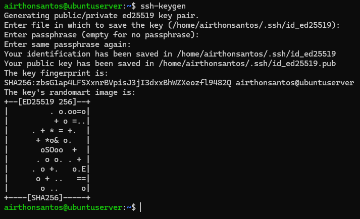
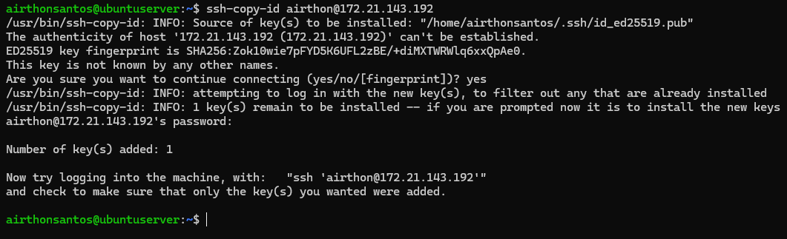
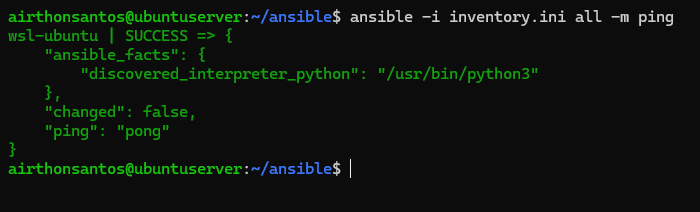
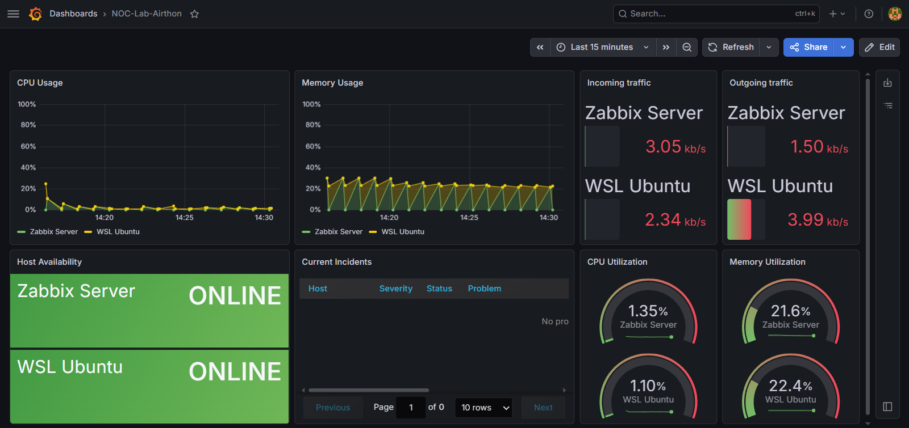
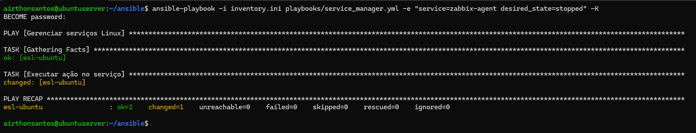
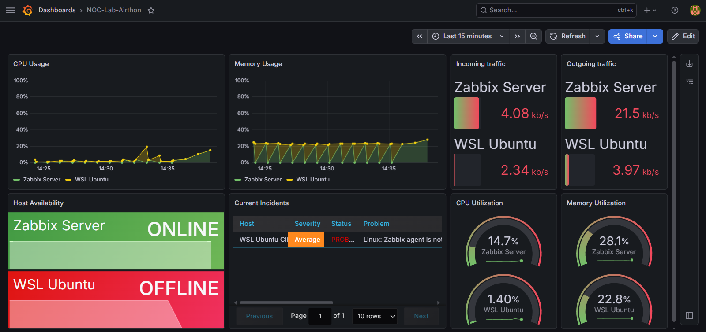
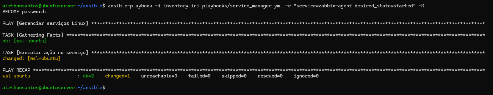
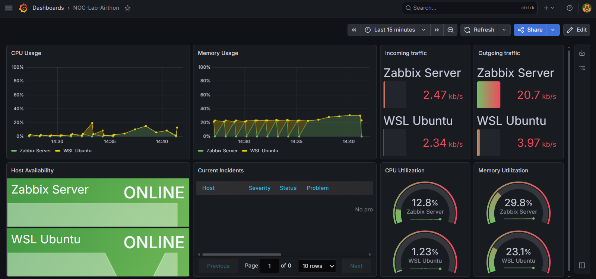

# Automação com Ansible

## 🎯 Objetivos

O objetivo desta etapa foi integrar o Ansible ao laboratório, criando o arquivo de inventário e os playbooks necessários para automatizar tarefas administrativas. Ao final, usei essa automação para validar todo o ecossistema construído até então por meio de incidentes simulados.

## ⚙️ Instalação

A instalação do Ansible foi relativamente simples, envolvendo apenas a atualização dos repositórios do sistema e a instalação da ferramenta.

O primeiro passo foi atualizar a lista de pacotes do Ubuntu Server.
```bash
sudo apt update
```

Em seguida, instalei o Ansible.
```bash
sudo apt install ansible -y
```

Optei por instalar o Ansible no próprio Ubuntu Server, pois isso permite interagir remotamente com os hosts monitorados por meio dos playbooks, aproximando o laboratório de um ambiente mais próximo da realidade.

Com a instalação concluída, o próximo passo foi criar o arquivo de inventário e os playbooks.
## Criação do Inventory e dos Playbooks

O inventário (Inventory) é o arquivo responsável por definir quais hosts serão gerenciados pelo Ansible. Nesta etapa, procurei manter a estrutura simples, adicionando apenas o WSL como host remoto. No entanto, o próprio Zabbix Server também poderia ser incluído futuramente.

A estrutura usada para esse laboratório foi a seguinte:
```ini
[wsl]
wsl-ubuntu ansible_host=172.21.143.192 ansible_user=airthon
```

Com o inventário configurado, o próximo passo foi criar uma chave SSH no Ubuntu Server. Essa chave permite que o Ansible estabeleça uma comunicação segura com WSL.

<details>
  <summary>📂 Clique aqui para ver a criação e o envio da chave SSH para o WSL</summary>
  <br>

- **Criação da Chave SSH**
    <p align="center">
      
    </p>

- **Envio da Chave SSH para o WSL**
    <p align="center">
      
    </p>

</details>

Para testar se tudo está configurado corretamente, realizei um ping pelo Ansible no WSL. O retorno abaixo confirma que o Ansible conseguia se comunicar corretamente.

<details>
  <summary>📂 Clique aqui para ver o ping realizado no Ansible até o WSL</summary>
  <br>

- **Ping realizado no Ansible até o WSL**
    <p align="center">
      
    </p>

</details>

Após validar a comunicação, desenvolvi três playbooks:
- `health_check.yml`: coleta informações gerais do host, como uptime, uso de disco e memória;
- `system_update.yml`: realiza a atualização dos pacotes e a limpeza do sistema;
- `service_manager.yml`: gerencia serviços do sistema, permitindo iniciá-los, interrompê-los ou reiniciá-los.

Com essa estrutura pronta, a etapa seguinte foi validar todo o fluxo operacional construído ao longo do laboratório.

## Validação Integrada do Ambiente

Para validar a integração entre todas as ferramentas usadas, usei o playbook `service_manager.yml` para interromper e restaurar o serviço `zabbix-agent` do WSL. Esse cenário permitiu validar o fluxo completo de operação do ambiente, desde a execução da ação pelo Ansible até a detecção do evento pelo Zabbix e sua visualização no Grafana.

A imagem abaixo mostra o dashboard antes da simulação do incidente, com todos os serviços operando normalmente.
<p align="center">
      
</p>

Em seguida, executei a automação responsável por interromper o serviço no WSL.

<details>
  <summary>📂 Clique aqui para visualizar o encerramento do Zabbix Agent pelo Ansible</summary>
  <br>

- **Encerrando o Zabbix Agent pelo Ansible**
    <p align="center">
      
    </p>

</details>

Na primeira execução, o playbook retornou erro. Como a operação exige privilégios administrativos (`sudo`), foi necessário usar o parâmetro `-K`, que solicita a senha de elevação de privilégios antes da execução.

Após alguns minutos, o dashboard do Grafana exibiu a indisponibilidade do host. O painel de disponibilidade passou a exibir o status `OFFLINE` e as métricas deixaram de ser atualizadas.

<p align="center">
      
</p>

Em seguida, restaurei o serviço usando o mesmo playbook.

<details>
  <summary>📂 Clique aqui para visualizar a inicialização do Zabbix Agent via Ansible</summary>
  <br>

- **Inicialização do Zabbix Agent via Ansible**
    <p align="center">
      
    </p>

</details>

Pouco tempo depois, o dashboard passou a exibir novamente o status `ONLINE`, confirmando a recuperação do host e o restabelecimento da coleta de métricas.

<p align="center">
      
</p>

Uma característica importante que observei durante os testes é que os playbooks do Ansible são idempotentes. Isso significa que, uma vez atingido o estado desejado, execuções subsequentes não realizam alterações desnecessárias no ambiente.

Com esse teste, foi possível validar a integração entre todas as camadas implementadas ao longo do laboratório. O Ansible executou a ação operacional, o Zabbix detectou automaticamente a indisponibilidade do host e o Grafana refletiu o evento no dashboard em tempo real.

Além de monitorar e visualizar métricas, o ambiente agora também conta com uma camada de automação. Com isso, o laboratório passou a reunir monitoramento, visualização e automação em uma única solução integrada, consolidando todos os objetivos propostos para o projeto.
## 📌 Resultado

Ao final desta etapa, o laboratório foi concluído com sucesso.

Durante essa fase foram abordados os seguintes tópicos:

- Instalação do Ansible
- Criação do Inventory
- Configuração do acesso via SSH
- Desenvolvimento de playbooks
- Automação de serviços
- Validação integrada entre Ansible, Zabbix e Grafana